# Lando Norris vs Lloyd Dwaah — Motion & Immersion Comparison

**Captured:** July 2026  
**Sites:** [landonorris.com](https://landonorris.com) · [lloyddwaah.com](https://lloyddwaah.com)  
**Screenshots:** [`screenshots/`](./screenshots/) (Playwright, desktop 1440×900 + iPhone 13)

---

## Executive summary

Both sites use **Lenis smooth scroll** and **GSAP** for scroll-driven motion. The reason Lando’s site feels smoother and more immersive is not primarily the scroll library — it is **how much of the journey is animated**, **how deep the visuals go**, and **how much content is choreographed per scroll pixel**.

| Perception | Lando Norris | Lloyd Dwaah |
|------------|--------------|-------------|
| Scroll feel | Continuous momentum; almost every section is a “chapter” | Strong opening (hero + ethos pins), then flatter static blocks |
| Visual depth | WebGL 3D, Rive motion graphics, multi-layer assets | SVG portrait, CSS textures, Framer fades |
| Content density | Store, calendar, helmet gallery, media grid, career story | Homepage: hero → ethos → principles carousel → partner logos → footer |
| Production scope | OFF+BRAND agency, Awwwards Site of the Year, dedicated 3D/Rive pipeline | Lean personal-brand rebuild on Vite + React |

**Goal for Lloyd:** Lando-*inspired* immersion at a Lloyd-appropriate scope — not a 1:1 clone of an F1 athlete platform.

---

## Side-by-side screenshots

### Hero (desktop)

| Lloyd Dwaah | Lando Norris |
|-------------|--------------|
| 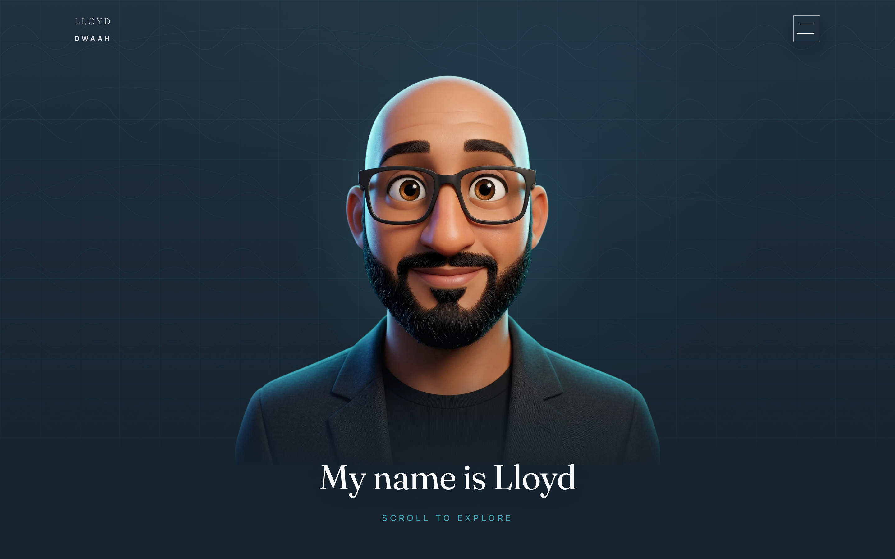 | 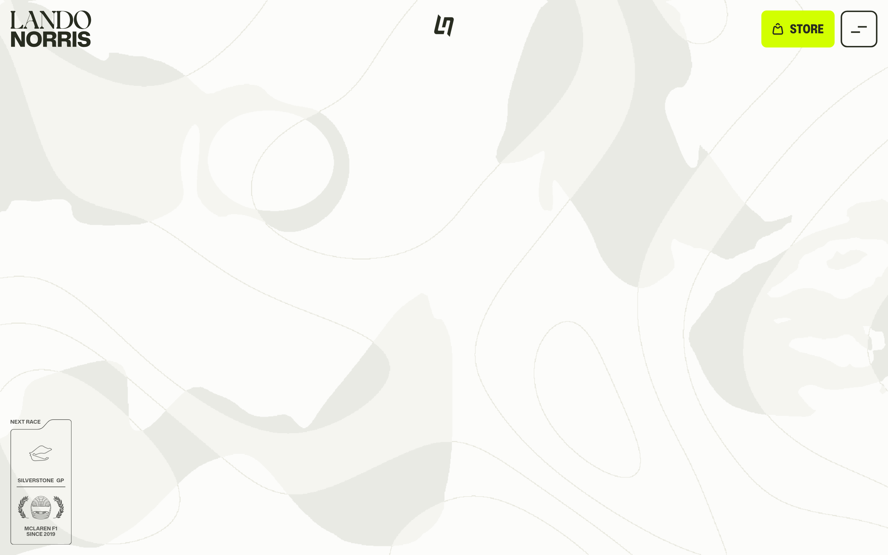 |

**Lloyd:** Dark cinematic hero — 3D-style portrait, grid/topo texture, name reveal, “Scroll to explore”. GSAP-pinned hero with scroll-scrubbed fade (`HomeCinematic.jsx`).  
**Lando:** Light editorial canvas — topographic contour lines, organic blobs, minimal UI chrome. Hero is a **loading chapter** before the 3D portrait/WebGL scene fully appears; heavy custom JS (`lando.OFF+BRAND.js`) + Rive.

---

### Mid-scroll (~35–40%)

| Lloyd Dwaah | Lando Norris |
|-------------|--------------|
| 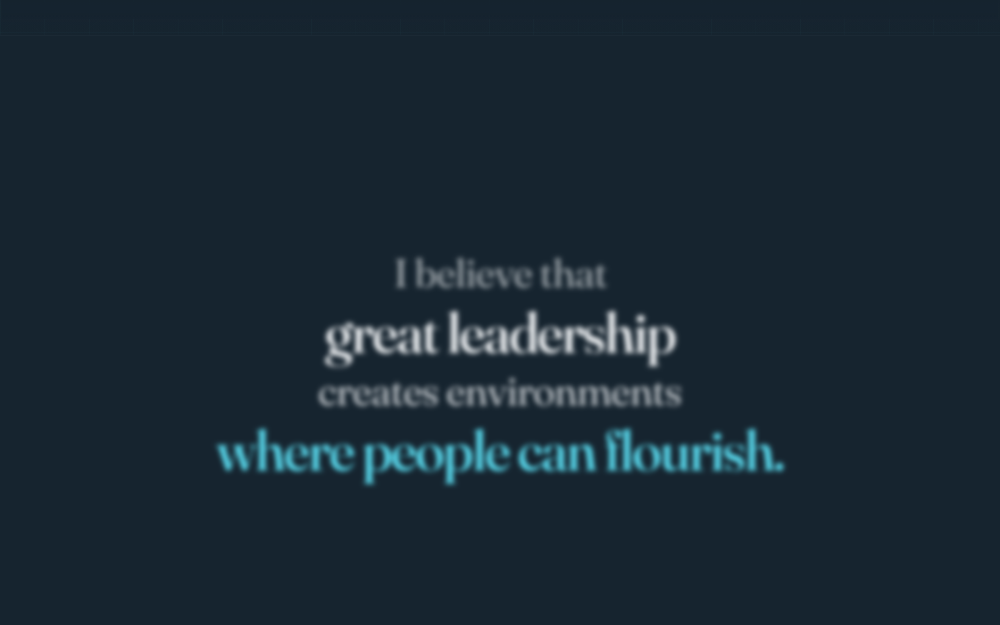 | 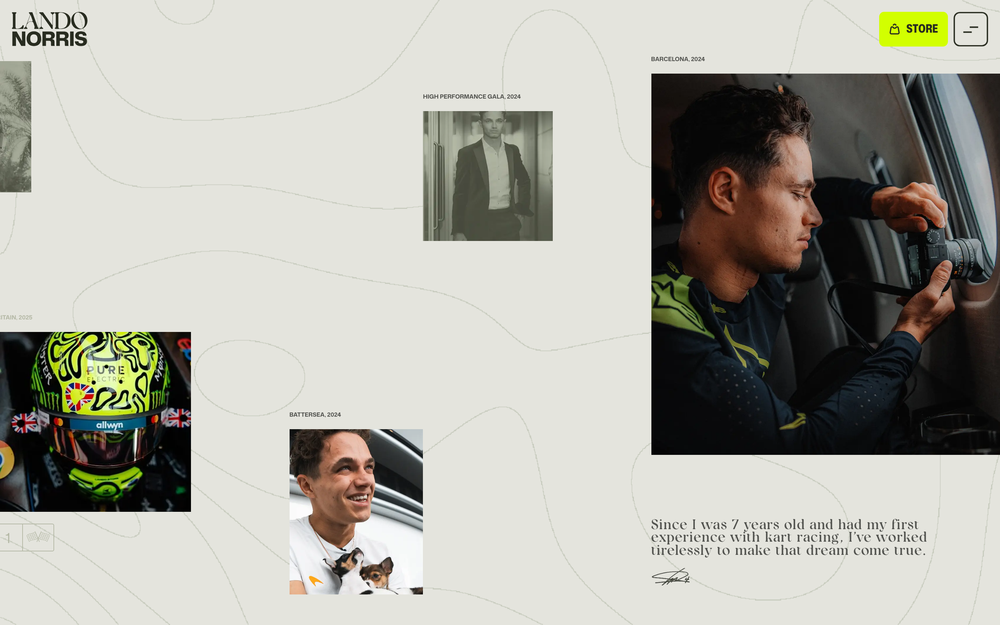 |

**Lloyd:** Ethos belief lines — GSAP blur/translate reveal while section is pinned. Strong typography moment, but **only four lines** then scroll continues to static content.  
**Lando:** Editorial **photo mosaic** — multiple labelled images (gala, Barcelona, Battersea), quote + signature, topo lines still animating. High content density per viewport; scroll feels like turning magazine pages.

---

### Deep scroll (~65–70%)

| Lloyd Dwaah | Lando Norris |
|-------------|--------------|
| 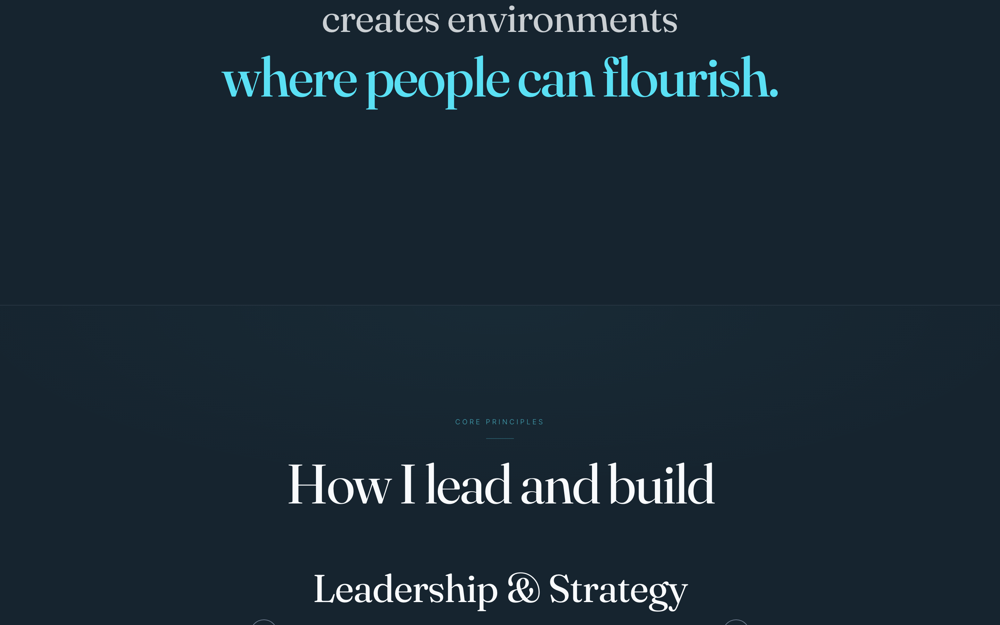 | 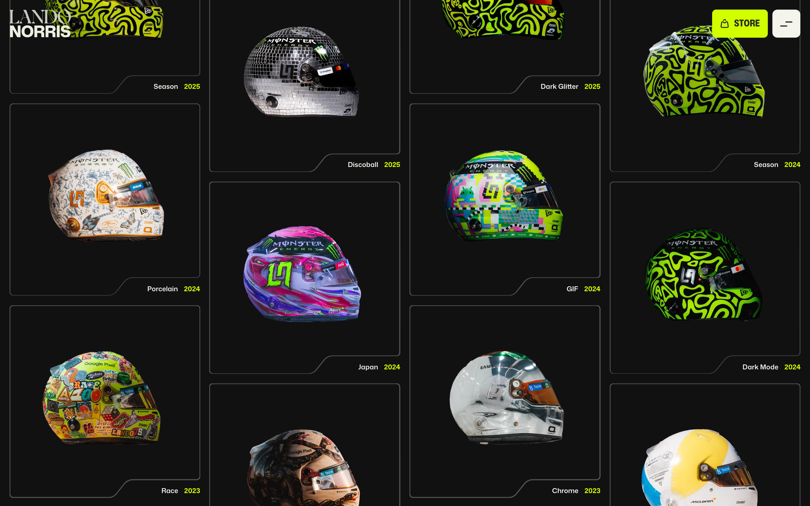 |

**Lloyd:** Transitional zone between ethos and lower sections (partner marquee / footer approach). Less visual event per scroll.  
**Lando:** **Helmets Hall of Fame** — grid of helmet cards with hover states, neon accents, years. Entire sections are interactive galleries, not carousels.

---

### Principles / content chapter

| Lloyd Dwaah | Lando Norris |
|-------------|--------------|
| 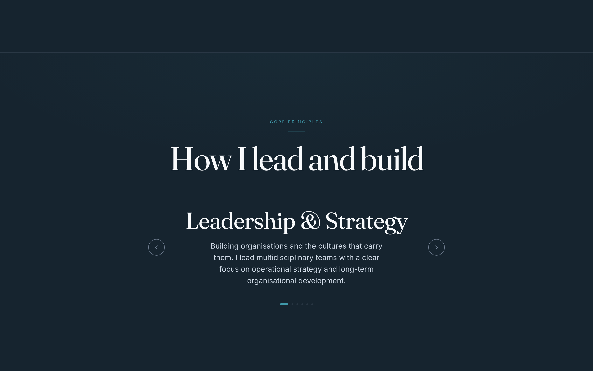 | 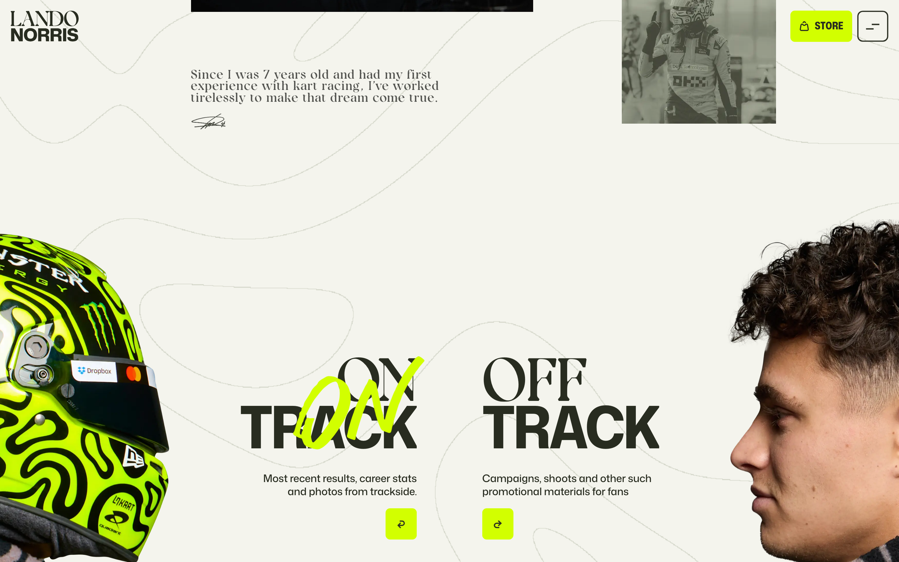 |

**Lloyd:** “Core principles” / “How I lead and build” — arrow carousel, title + two sentences, dot indicators. **Click-driven**, not scroll-scrubbed.  
**Lando:** Onboarding-style chapter — illustrated card stack, “TAP TO OPEN”, numbered steps (01 Message, 02 Icons). **Touch/hover-first** micro-interactions throughout.

---

### Mobile hero

| Lloyd Dwaah | Lando Norris |
|-------------|--------------|
| 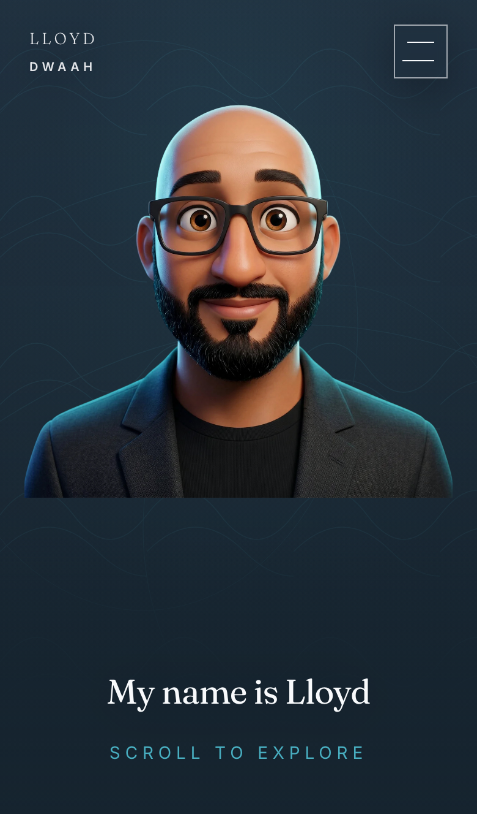 | 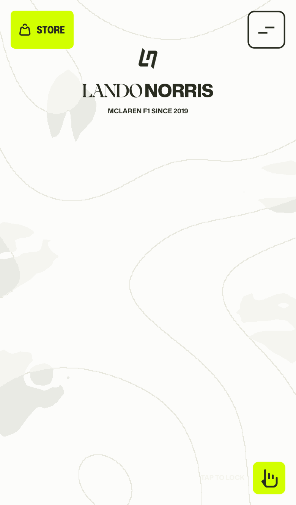 |

**Lloyd:** Portrait-forward mobile hero; Lenis `syncTouch: true` enabled. Hero parallax disabled on touch (`HeroPortrait.jsx`).  
**Lando:** Dedicated mobile Rive assets (`mob-landscape.riv` per public mirrors); lighter hero shell, loads into richer sequences.

---

## Technical comparison

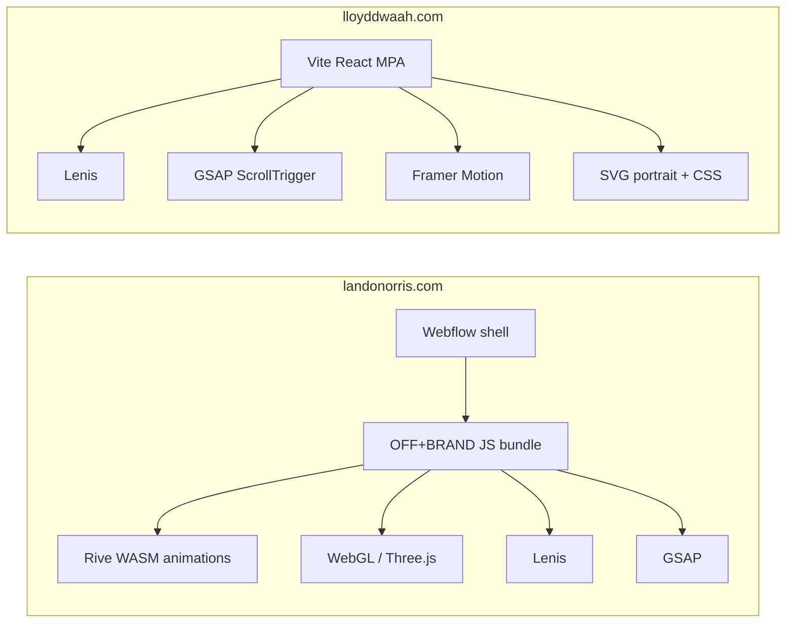

| Dimension | Lando Norris | Lloyd Dwaah | Lloyd file(s) |
|-----------|--------------|-------------|---------------|
| **Platform** | Webflow + custom CDN bundles | Vite multi-page React app | `vite.config.js`, `src/shared/mount.jsx` |
| **Smooth scroll** | Lenis (in OFF+BRAND bundle) | Lenis `duration` 0.8 desktop / 0.9 touch | `src/components/SmoothScroll.jsx` |
| **ScrollTrigger** | Extensive scrub timelines | 2 homepage pins (hero + ethos) | `src/components/HomeCinematic.jsx` |
| **3D / WebGL** | Multi-layer scene (portrait, helmet, glass, HDRI) | Unused `Scene3D.jsx`; SVG hero | `src/components/HeroPortrait.jsx` |
| **Vector motion** | 8+ Rive files (transitions, UI, circuits) | Framer curtain preloader/transitions | `Preloader.jsx`, `PageTransition.jsx` |
| **Typography motion** | Per-letter split spans, staggered transforms | Block blur lines (ethos); carousel crossfade | `HomeCinematic.jsx`, `CorePrinciples.jsx` |
| **Page transitions** | Full-screen Rive isolate | Framer Y-translate curtain (~0.55s) | `src/lib/pageTransition.js` |
| **Inner pages** | Same immersive stack | `Reveal.jsx` scroll fades; Ventures GSAP logos | `VentureLogoJourney.jsx`, `ExperiencePage.jsx` |
| **Homepage sections** | Many chapters | 4 blocks | `src/pages/HomeOnly.jsx` |
| **Asset weight** | Large (WebGL textures, .riv, GLB, KTX2) | Moderate (SVG, webp, code-split JS) | `public/assets/` |

### Why Lloyd can feel less smooth (specific causes)

1. **Scroll animation density drops after ethos** — only ~2 pinned sequences on the homepage; principles and marquee are not scrub-driven.
2. **ScrollTrigger refresh on layout change** — `ResizeObserver` on `document.body` recalculates pin spacing when carousel content changes height (partially mitigated in `CorePrinciples.jsx` with fixed slide height + `overflowAnchor: none`).
3. **Touch Lenis tuning** — `syncTouchLerp: 0.08` can feel “floaty” or laggy compared to Lando’s tuned production curves.
4. **Competing scroll consumers** — Lenis proxy + GSAP ticker + Framer `useInView` + manual `scrollTo` on nav; more listeners than Lando’s single orchestrated bundle.
5. **Lighter GPU story** — SVG + CSS vs WebGL shaders; fewer parallax layers means less “depth” motion when dragging.

---

## Experience comparison

| Cue | Lando | Lloyd |
|-----|-------|-------|
| **First visit** | Branded load → WebGL hero | Session preloader curtain → portrait (`Preloader.jsx`) |
| **Scroll rhythm** | Chapter every ~1 viewport; constant motion | 2 cinematic peaks, then static |
| **Micro-interactions** | Clip-path hovers, helmet card lifts, store CTA | Carousel arrows, marquee hover opacity, menu morph |
| **Typography** | Split-letter reveals, bold lime accents | Fraunces + Inter, cyan accent — editorial not racing |
| **Content types** | Commerce, calendar, gallery, story, media | Principles, partners, footer contact; depth on inner MPA pages |
| **Mobile** | Dedicated Rive + simplified layouts | Lenis touch on; parallax off; carousel swipe |

---

## Gap analysis (mapped to codebase)

| Capability | Lando | Lloyd status | Gap |
|------------|-------|--------------|-----|
| Continuous scroll chapters | Yes | Partial (hero + ethos only) | **High** |
| WebGL / 3D hero | Yes | `Scene3D.jsx` exists, unused | **High** (optional) |
| Rive transitions | Yes | Framer curtain only | **Medium** |
| Split-text reveals | Yes | Block lines only | **Medium** |
| Scroll-scrubbed sections below fold | Yes | Static carousel + CSS marquee | **High** |
| Rich homepage content modules | Many | 4 sections | **Medium** |
| Smooth scroll foundation | Lenis + GSAP | Lenis + GSAP | **Low** (aligned) |
| Page transitions | Rive full-screen | Framer wipe | **Medium** |
| Performance / jank fixes | Agency-tuned | Recent carousel + preloader fixes | **Medium** |

---

## What to borrow vs skip

### Borrow (high value, Lloyd-appropriate)

- **Scroll chapter model** — treat principles, partners, and footer as pinned/scrubbed sequences, not static mounts.
- **Split-text or staggered word reveals** for ethos and section headings.
- **Consistent motion language** — same easing (`[0.22, 1, 0.36, 1]`) and durations sitewide; homepage should use `Reveal` patterns like inner pages.
- **More content per scroll viewport** — teasers linking to Experience, Ventures, Publications on homepage.
- **Debounced ScrollTrigger refresh** — fewer pin recalculations during interaction.

### Skip (unless major investment)

- Full WebGL helmet pipeline, MSDF fonts, KTX2 texture stacks.
- Webflow migration.
- Lando lime palette, LN monogram patterns, F1-specific UI.
- 75k-line custom bundle — evolve incrementally in React instead.

---

## Phased roadmap

Recommended order: **Phase A → Phase B (partial) → Phase C**. Phase D only if you want a “wow” hero investment.

### Phase A — Smoothness fixes

**Effort:** 1–2 days · **Impact:** High · **Risk:** Low

| Task | Target file(s) | Notes |
|------|----------------|-------|
| Debounce `ResizeObserver` → `ScrollTrigger.refresh()` | `SmoothScroll.jsx` | 150–250ms debounce; skip refresh if height delta &lt; threshold |
| Tune mobile Lenis | `SmoothScroll.jsx` | Try `syncTouchLerp: 0.12–0.15`, `duration: 0.75` on touch |
| Audit `will-change` | `HomeCinematic.jsx`, `HeroPortrait.jsx` | Remove where causing layer promotion thrash |
| Single refresh entry point | `lib/gsap.js` | `refreshScrollTriggers()` called from one place after layout settles |
| Carousel isolation | `CorePrinciples.jsx` | Already has fixed height; verify no `refreshScrollTriggers` on slide change |

**Success metric:** No scroll jump when changing principles; drag-scroll feels tighter on mobile.

---

### Phase B — Scroll storytelling

**Effort:** 3–5 days · **Impact:** Very high · **Risk:** Medium

| Task | Target file(s) | Notes |
|------|----------------|-------|
| Pin + scrub **principles** section | `CorePrinciples.jsx`, `HomeOnly.jsx` | Title + copy reveal on scroll instead of click-only carousel |
| Pin + scrub **partner marquee** | `PartnerMarquee.jsx` | Opacity/speed tied to scroll progress |
| Add homepage teasers | New `HomeTeasers.jsx`, `site.js` | Experience / Ventures / Publications cards with scrub entrance |
| Ethos split-text | `HomeCinematic.jsx` | Wrap words in spans; GSAP stagger (or lightweight util) |
| Subtle mobile parallax | `HeroPortrait.jsx` | `parallax: 0.15` on touch vs `0` today |

**Success metric:** Homepage feels like 4–5 chapters; scroll never “dead” for more than one viewport.

---

### Phase C — Transition & polish

**Effort:** 2–3 days · **Impact:** Medium · **Risk:** Low

| Task | Target file(s) | Notes |
|------|----------------|-------|
| Richer page transition | `PageTransition.jsx` | Longer ease, optional branded frame asset |
| Homepage `Reveal` parity | `HomeOnly.jsx`, sections | Stagger section headers like inner pages |
| Marquee scroll-link | `PartnerMarquee.jsx` | Scrub opacity 0.55 → 1 with scroll |
| Nav scroll state | `SiteNav.jsx` | Smoother overlay → solid transition on scroll |

**Success metric:** MPA navigation feels premium; visual consistency across pages.

---

### Phase D — Visual depth (optional)

**Effort:** 1–3 weeks · **Impact:** High “wow” · **Risk:** High (weight, maintenance)

| Task | Target file(s) | Notes |
|------|----------------|-------|
| WebGL hero layer | `Scene3D.jsx` or new `HeroWebGL.jsx` | Portrait depth, grain, light sweep — replace or layer on SVG |
| Higgsfield / video atmosphere | `public/assets/`, `HeroPortrait.jsx` | Loop behind portrait |
| Rive transition (if asset available) | New integration | Replace Framer curtain on key routes |
| Principles visual | `CorePrinciples.jsx` | Sunglasses/glass asset slot (already scaffolded historically) |

**Success metric:** Hero matches Lloyd brand with Lando-*level* depth without copying F1 visuals.

---

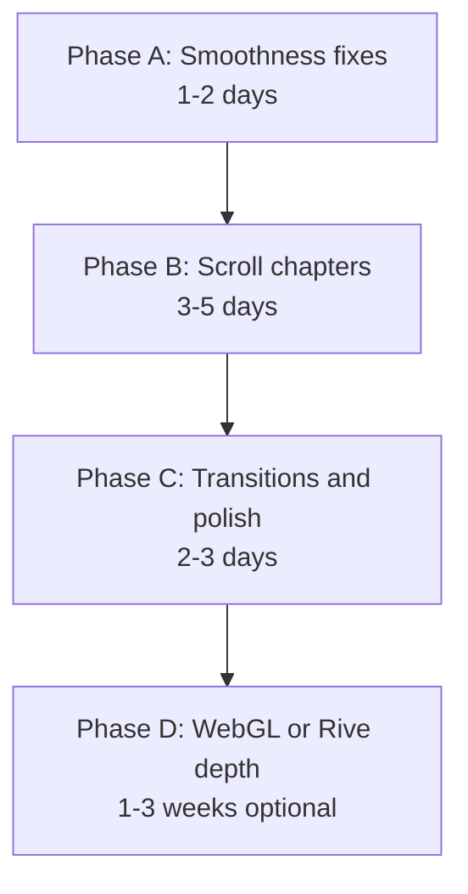

**Recommended start:** Phase A + first item of Phase B (scroll-scrubbed principles section). Largest perceived immersion gain for effort.

---

## Appendix: screenshot capture

Re-run captures:

```bash
cd "/Users/lloyddwaah/Lloyd website-new"
node scripts/capture-comparison-screenshots.mjs
```

Requires `playwright` (devDependency) and Chromium (`npx playwright install chromium`).

| File | Description |
|------|-------------|
| `lloyd-hero.png` | Lloyd desktop top |
| `lloyd-mid.png` | Lloyd ~40% scroll (ethos) |
| `lloyd-deep.png` | Lloyd ~70% scroll |
| `lloyd-principles.png` | Lloyd `#principles` |
| `lloyd-mobile-hero.png` | Lloyd iPhone 13 viewport |
| `lando-hero.png` | Lando desktop top |
| `lando-mid.png` | Lando ~35% scroll |
| `lando-deep.png` | Lando ~65% scroll (helmets grid) |
| `lando-content-chapter.png` | Lando ~45% scroll |
| `lando-mobile-hero.png` | Lando iPhone 13 viewport |

---

## References

- [OFF+BRAND case study — Lando Norris](https://www.itsoffbrand.com/our-work/lando-norris)
- Lloyd motion docs: [`LOCAL.md`](../../LOCAL.md)
- Lloyd stack: Lenis + GSAP in [`src/components/SmoothScroll.jsx`](../../src/components/SmoothScroll.jsx), homepage cinema in [`src/components/HomeCinematic.jsx`](../../src/components/HomeCinematic.jsx)
